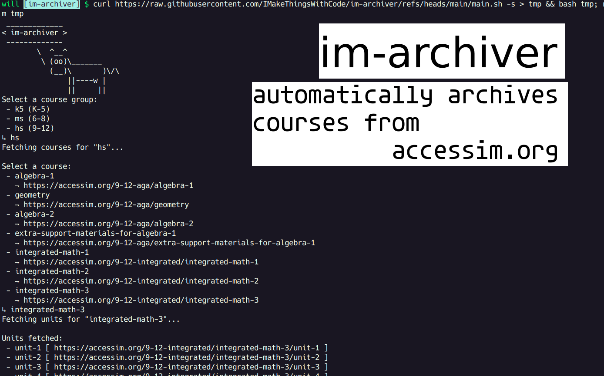

# 📜 im-archiver 🧮
Automatically archives courses from Illustrative Mathematics' accessim.org

[Link to Summer of Making project](https://summer.hackclub.com/projects/6131)



This summer, I have to learn Integrated 3 as I'd like to test out of it. So, I'm building this tool that archives the free courses on accessim.org for offline use.

> This script has been tested on Linux only. It has not been tested on macOS or Windows (through WSL).

## Try it out:
```sh
curl https://raw.githubusercontent.com/IMakeThingsWithCode/im-archiver/refs/heads/main/main.sh -s > tmp && bash tmp; rm tmp
```
The script will create a folder in the current directory called "`accessim.org`." This folder will contain all the resources. Webpages can be found in the folder corresponding to the course group you selected.

### Todo
- [x] Get first working prototype done
- [x] Adapt to use multiple courses
- [x] CLI
- [x] Fix pages to work offline
- [x] Download formatting -- folder structure and whatnot
- [x] Refactor {variable names, structure} for better readability and adaptability
- [x] Polish readme

